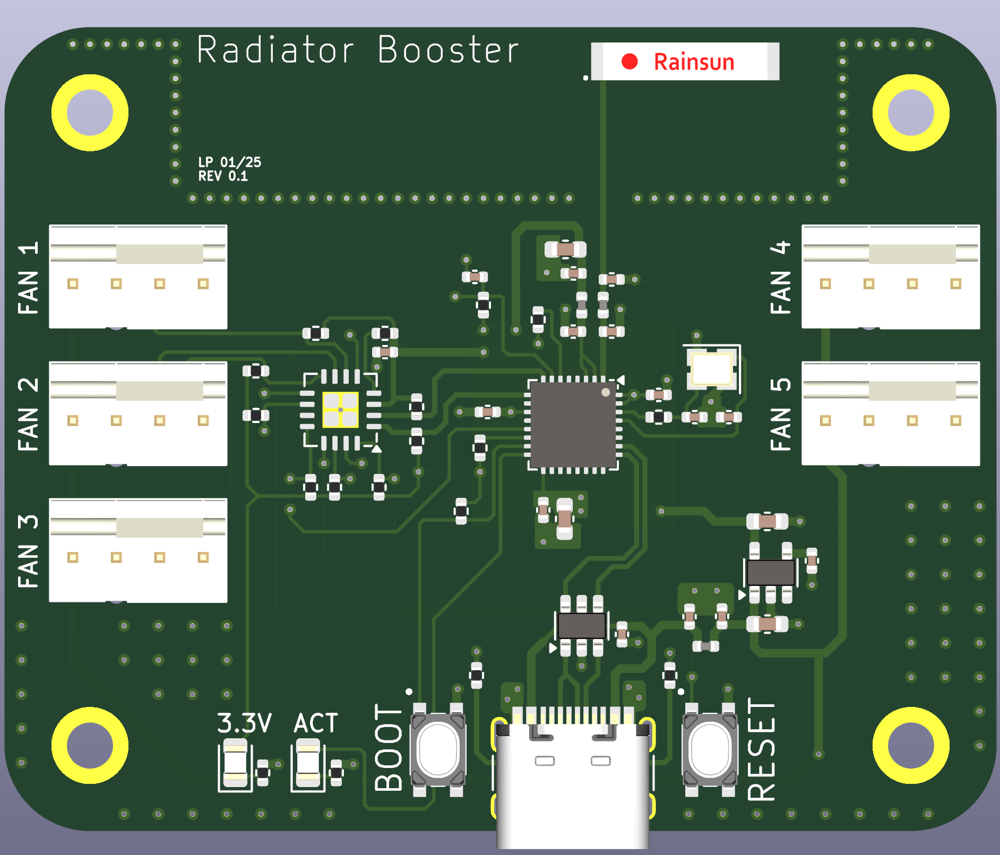

# Radiator Booster
ESP32C3 based fan control board for a modular  [3d printed radiator booster](https://www.printables.com/model/329566-heizkorperverstarker-mit-magnethalterung-radiator-?lang=de) based on this design.
The idea is to use ESPHome with Home Assistant to turn on up to 5 radiator booster fans, when my smart thermostats are turning on, and use a Home Assistant automation to keep them running for an hour and automatically shut them off after that.

For an interactive KiCad experience see:
[Radiator Booster](https://kicanvas.org/?github=https://github.com/lzptr/radiator_booster/tree/main/hardware).
